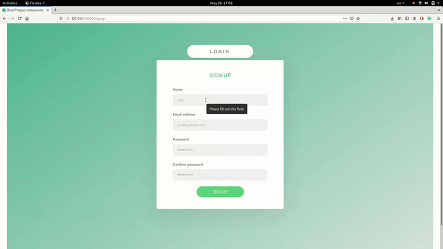
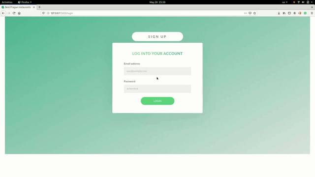

# EasyEats

## Objective

A restaurant recommender where it grabs daily menus from Prague's restaurants
and gives recommendations based on users choices.

## Requirement

* MySQL server
* Python 3.x
* Any browser

## Installation

This application will be a web-based application that could be visited here:
 ["www.easyeats.live"]

## Examples

### Sign in:

### Login:

### General Usage

## Limitations

* The data for this application fully dependent on Zomato API.
* Website is not responcive, thus experience on mobile devices is not ideal.

## Dependencies

This application depends on a multiple of libraries that provided code snippets
or functions pre-defined by the authors listed below:

* [Flask](https://github.com/pallets/flask), The Pallets Projects, 1.1.2, GitHub.
* [requests](https://github.com/psf/requests), Python Software Foundation, 2.23.0, GitHub.
* [mysql_connector](https://github.com/mysql/mysql-connector-python), MySQL, 8.0.20, GitHub.
* [mysql_connector_repackaged](https://pypi.org/project/mysql-connector-repackaged/), The Python Package Index (PyPI), 0.3.1, Website. 
* [Unidecode](https://pypi.org/project/Unidecode/), The Python Package Index (PyPI), 1.1.1, Website.
* [cryptografy](https://github.com/pyca/cryptography), Python Cryptographic Authority, 2.9.2, GitHub.
* [click](https://github.com/pallets/click), The Pallets Projects, 7.1.2, GitHub.
* [Flask-MySQLdb](https://github.com/admiralobvious/flask-mysqldb), Ferland, A. (2015), 0.2.0, GitHub.
* [Flask_JWT_Extended](https://pypi.org/project/Flask-JWT-Extended/)
* [itsdangerous](https://github.com/pallets/itsdangerous), The Pallets Projects, 2.0.0a1, GitHub.
* [Jinja2](https://github.com/pallets/jinja), The Pallets Projects, 2.11.2, GitHub.
* [MarkupSafe](https://github.com/pallets/markupsafe), The Pallets Projects, 2.0.0a1, GitHub.
* [mysqlclient](https://github.com/PyMySQL/mysqlclient-python), PyMySQL, 1.4.6, GitHub.
* [Werkzeug](https://github.com/pallets/werkzeug), The Pallets Projects, 1.0.1, GitHub.
* [Flask_JWT_Extended](https://pypi.org/project/Flask-JWT-Extended/), The Python Package Index (PyPI), 3.24.1, Website.
* [responses](https://github.com/getsentry/responses), Sentry, 0.10.14, GitHub.

## References

* Nash, J. (2019) Learning Flask. Available at: [YouTube](https://www.youtube.com/watch?v=BUmUV8YOzgM&list=PLF2JzgCW6-YY_TZCmBrbOpgx5pSNBD0_L&index=1) [Accessed: 18 April 2020].
* pytest-dev. (2020) PyTest Documentation. Available at: [Website](https://docs.pytest.org/en/latest/contents.html#full-pytest-documentation) [Accessed: 30 March 2020].
* Ellingwood, J, Juell, K. (2020) How To Serve Flask Applications with uWSGI and Nginx on Ubuntu 18.04. Available at: [Tutorial](https://www.digitalocean.com/community/tutorials/how-to-serve-flask-applications-with-uswgi-and-nginx-on-ubuntu-18-04)  [Accessed: 18 May 2020].
* The Open Web Application Security Project (OWASP). (2020) OWASP Top Ten. Available at: [Website](https://owasp.org/www-project-top-ten/) [Accessed: 14 March 2020].

## License

Copyright © 2020 Ilyas Sakhanov, Sulieman Al Rustom, Daniel De Corte,
Riccardo Stoppani, Iryna Kulinuch, Donnel Mandimika, Stanislav Brusnicky, Jan Dvorak.

This program and the accompanying materials are made available under the
terms of the Eclipse Public License 2.0 which is available at
http://www.eclipse.org/legal/epl-2.0.

This Source Code may also be made available under the following Secondary
Licenses when the conditions for such availability set forth in the Eclipse
Public License, v. 2.0 are satisfied: GNU General Public License as published by
the Free Software Foundation, either version 2 of the License, or (at your
option) any later version, with the GNU Classpath Exception which is available
at https://www.gnu.org/software/classpath/license.html.

## Contributors

- [Ilyas Sakhanov](https://github.com/ilyassakhanov)
- [Sulieman Al Rustom](https://github.com/Slemanof)
- [Stanislav Brusnicky](https://github.com/Stanley008)
- [Daniel De Corte](https://github.com/DeCortez)
- [Riccardo Stoppani](https://github.com/riccardosl)
- [Iryna Kulinuch](https://github.com/irinakulinich3712)
- [Donnel Mandimika](https://github.com/donnelmandimika)
- [Jan Dvorak](https://github.com/jandvorak-dot)

